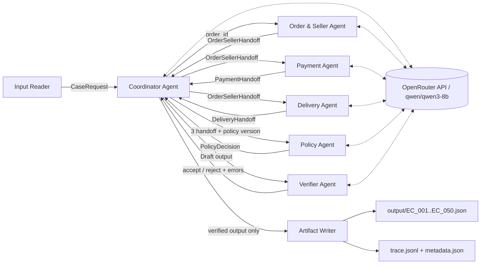

# Kiến trúc Multi-Agent xử lý tranh chấp Olist

## 1. Mục tiêu thiết kế

Hệ thống xử lý 50 case theo `EC_POLICY_V1`, chỉ sử dụng sự kiện có thể kiểm
chứng từ CSV và tạo output tái lập. Tất cả agent gọi chung model API
`qwen/qwen3-8b` qua OpenRouter. Model có 8.2B tham số, thấp hơn giới hạn 10B. Code Python
giữ vai trò guardrail cho join CSV, phép tính tiền, policy và evidence để model
không thể tự tạo sự kiện. Cấu hình model được commit trong
`src/ecommerce_dispute/config.py` và ghi lại trong `metadata.json`.

## 2. Sơ đồ agent và quyền điều phối



Coordinator là agent cha duy nhất. Worker không gọi nhau, không tự phân công,
không ghi file và không thay đổi handoff đã nhận. Mỗi worker chỉ thực hiện lệnh
có kiểu rõ ràng từ Coordinator rồi trả một immutable dataclass. Vì vậy không có
hai agent cùng sở hữu một artifact và không phát sinh write conflict. Sáu agent
dùng chung một API gateway theo lượt, không cài hoặc tải model trên máy local.

## 3. Vai trò và quyền truy cập

| Thành phần | Dữ liệu được đọc | Output | Quyền ghi |
|---|---|---|---|
| Coordinator Agent | Input, handoff, Qwen route review | Draft output, lệnh phân công | Không ghi trực tiếp |
| Order & Seller Agent | `orders`, `order_items`, `sellers`, Qwen review | `OrderSellerHandoff` | Không |
| Payment Agent | `order_payments`, tổng tiền, Qwen review | `PaymentHandoff` | Không |
| Delivery Agent | Timestamp và Qwen review | `DeliveryHandoff` | Không |
| Policy Agent | Ba handoff, policy, Qwen review | `PolicyDecision` | Không |
| Verifier Agent | Draft, CSV gốc, Qwen review | `VerificationHandoff` | Không |
| Artifact Writer | Output đã được Verifier chấp nhận | JSON/JSONL/metadata | Có, ghi nguyên tử |

`OlistRepository` tạo index chỉ đọc và trả về mapping/sequence bất biến. Agent
không nhận API ghi dữ liệu. Verifier đọc lại nguồn gốc độc lập thay vì tin các
con số do Coordinator tổng hợp.

## 4. Hợp đồng handoff

- `CaseRequest`: `case_id`, `order_id`, `policy_version` và nội dung yêu cầu.
- `OrderSellerHandoff`: trạng thái order, timestamp, item, seller vi phạm, tổng
  item và freight.
- `PaymentHandoff`: từng payment row, tổng payment, chênh lệch và kết quả đối
  soát trong sai số `0.10 BRL`.
- `DeliveryHandoff`: giao trễ/đúng hạn và danh sách seller bàn giao muộn.
- `PolicyDecision`: issue, root cause, responsible party, refund và action.
- `VerificationHandoff`: `accepted` cùng danh sách lỗi máy đọc được.

Các contract nằm trong `src/ecommerce_dispute/contracts.py`, đều là
`@dataclass(frozen=True)`. Mỗi handoff chứa `LLMReview`: tên model, JSON trả về,
thời gian gọi và kết quả so sánh với guardrail. Trace lưu cả chiều gửi/nhận,
loại thông điệp, payload và SHA-256 để chứng minh handoff/model call thực tế.

## 5. Luồng xử lý một case

1. Input Reader kiểm tra tên file và `case_id`, sau đó gửi case cho Coordinator.
2. Coordinator gọi Qwen3-8B để lập route và chỉ chấp nhận dependency order an toàn.
3. Coordinator ra lệnh cho Order & Seller Agent truy xuất order và item; worker
   gọi Qwen để review domain facts rồi đối chiếu với timestamp bằng code.
4. Coordinator chuyển handoff bất biến cho Payment Agent và Delivery Agent; mỗi
   worker gọi model và guardrail kiểm tra lại boolean/tổng tiền.
5. Coordinator gửi ba kết quả domain cho Policy Agent.
6. Policy Agent gọi model rồi áp dụng thứ tự ưu tiên trong README: canceled, unavailable,
   seller late, logistics late, split payment hợp lệ, late claim không hợp lệ.
7. Coordinator dựng draft nhưng chưa được phép ghi file.
8. Verifier gọi model audit, đồng thời tự đối chiếu schema, giới hạn số ID, CSV, evidence, số tiền,
   root cause, responsible party và action.
9. Chỉ khi deterministic verifier trả `accepted=true`, Coordinator phát `approved_output` cho Artifact
   Writer. Pipeline giải quyết đủ 50 case trong bộ nhớ rồi mới ghi, tránh một
   submission nửa chừng nếu case sau thất bại.

## 6. Kiểm soát xung đột và lỗi

- Single writer: worker và Coordinator không được ghi `output/`.
- Immutable handoff: worker không thể sửa kết quả của worker khác.
- Sequential case orchestration: thứ tự trace và artifact luôn xác định.
- Atomic replace: JSON, trace và metadata được ghi qua file tạm rồi replace.
- Latest-run trace: `trace.jsonl` bị thay thế mỗi lần chạy, không append.
- Fail closed: policy không khớp hoặc verifier phát hiện sai thì pipeline dừng
  trước khi ghi bộ output mới.
- LLM required: production dừng nếu thiếu `OPENROUTER_API_KEY` hoặc API
  `qwen/qwen3-8b` không sẵn sàng; không
  có fallback âm thầm sang fake/rule-only.
- Model guardrail: Qwen chỉ review/lập kế hoạch; ID, timestamp và tiền từ CSV là
  nguồn sự thật cuối cùng.
- ZIP hard gate: chỉ tạo ZIP nếu đủ đúng `EC_001.json` đến `EC_050.json`.

## 7. Kiểm thử và vận hành

Không có dependency runtime bên ngoài Python standard library.

```powershell
$env:PYTHONPATH='src'
python -X utf8 -m unittest discover -s tests -v
python -X utf8 -m ecommerce_dispute.cli --root . --zip
```

Test bao phủ OpenRouter gateway, fail-closed API key/model identity check, sáu nhánh policy, độ ưu
tiên, policy version sai, chạy end-to-end
50 case, phân phối issue, 650 trace event, đủ 300 model invocation, false-positive
evidence, giới hạn model và hard gate ZIP. Unit test dùng model double; lượt CLI
nộp bài bắt buộc dùng OpenRouter API thật và metadata ghi token/thời gian gọi thực.

API key chỉ nằm trong `.env` dưới tên `OPENROUTER_API_KEY`; `.env` bị Git ignore.
Tên provider, endpoint, model ID và kích thước model được commit trong source.
Mỗi API response phải trả đúng `model=qwen/qwen3-8b`; pipeline fail closed nếu
provider trả model khác và không cấu hình `openrouter/auto` hay fallback model.

## 8. Artifact

- `output/EC_001.json` ... `output/EC_050.json`: kết quả đã verify.
- `trace.jsonl`: trace thật của lượt chạy mới nhất.
- `metadata.json`: model, kích thước, framework, runtime và thống kê run.
- `output.zip`: đúng 50 JSON để nộp, không chứa source, secret hay audit file.
